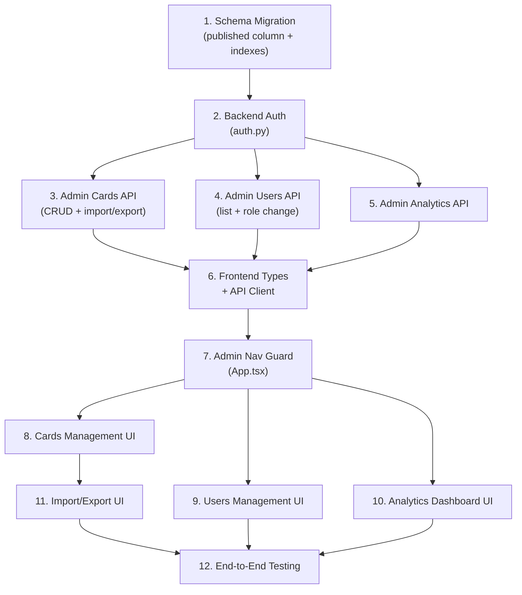

# Phase 3: Admin & Content Management — Action Plan

> **Based on:** `proposal.md` §3.1–3.3  
> **Codebase reviewed:** `backend/main.py`, `frontend/src/`, `supabase/schema.sql`  
> **Date:** September 2026

---

## Current State Assessment

Before building, here's what exists and what's missing:

| Layer | What Exists | What's Missing for Phase 3 |
|---|---|---|
| **Backend (`main.py`)** | 6 endpoints (health, bootstrap, delete account, socratic-reflect, request-code, verify-code). No auth middleware — token extraction is manual per-route. Single-file, ~621 lines. | All admin endpoints. Reusable auth dependency. Role-based guards. Admin router. |
| **Frontend** | 4 tabs (`deck`, `vault`, `discovery`, `account`). Manager role gates card creation in `DiscoveryView`. No admin view. | Admin tab/route. Card management UI. User management UI. Analytics dashboard. Import/export UI. |
| **Database** | `profiles` (with role column), `cards`, `card_vouches`, `reflection_sessions`. RLS policies. Vouch count trigger. | `published` column on `cards`. Indexes for admin queries. |
| **Auth/Roles** | `UserRole = 'user' | 'creator' | 'manager'`. Role stored in `profiles.role`. RLS enforces creator/manager for card INSERT. | Server-side role validation in FastAPI. No `'admin'` role yet (proposal suggests using `'manager'` for now). |

---

## Architecture Decisions

1. **Admin routes live in the backend (FastAPI)**, not via direct Supabase client calls from the frontend. This ensures role checks happen server-side where the service-role key lives, and prevents client-side bundle from revealing admin logic.
2. **Single new file `backend/admin.py`** as a FastAPI `APIRouter` mounted at `/api/admin`, keeping `main.py` clean.
3. **Reusable auth dependencies** (`get_current_user`, `require_manager`) added to `backend/auth.py`.
4. **New frontend tab `'admin'`** visible only to managers, with sub-views for Cards, Users, and Analytics.
5. **Schema migration** adds a `published` boolean to `cards` and indexes for admin query performance.

---

## Step-by-Step Implementation

### Step 1 — Database Schema Migration

**File:** `supabase/schema.sql` (update) + new migration script

Add the `published` column to `cards` for visibility toggling:

```sql
-- Migration: Add published column to cards
ALTER TABLE public.cards 
  ADD COLUMN IF NOT EXISTS published boolean NOT NULL DEFAULT true;

-- Update existing cards to be published
UPDATE public.cards SET published = true WHERE published IS NULL;

-- Index for admin card listing (sort by created_at, filter by published)
CREATE INDEX IF NOT EXISTS idx_cards_created_at ON public.cards (created_at DESC);
CREATE INDEX IF NOT EXISTS idx_cards_published ON public.cards (published);

-- Index for admin user listing
CREATE INDEX IF NOT EXISTS idx_profiles_created_at ON public.profiles (created_at DESC);
CREATE INDEX IF NOT EXISTS idx_profiles_role ON public.profiles (role);

-- Update the public SELECT policy on cards to only show published cards to non-admins
-- (Admin endpoints bypass RLS via service-role key, so they see everything)
DROP POLICY IF EXISTS "Anyone can read cards" ON public.cards;
CREATE POLICY "Anyone can read published cards"
  ON public.cards FOR SELECT
  USING (published = true);
```

> [!IMPORTANT]
> The frontend `fetchCards()` in `database.ts` uses the anon key (subject to RLS), so unpublished cards automatically become invisible to regular users without any frontend changes.

**Checklist:**
- [ ] Write migration SQL file `supabase/migrations/003_admin_features.sql`
- [ ] Run migration against Supabase instance
- [ ] Verify existing cards have `published = true`
- [ ] Verify frontend deck still loads (RLS policy updated)

---

### Step 2 — Backend Auth Dependencies

**New file:** `backend/auth.py`

Create reusable FastAPI dependencies for token validation and role enforcement:

```python
# backend/auth.py

from fastapi import Header, HTTPException, Depends
from supabase import Client
from main import get_supabase_admin  # or refactor into shared module

class AuthenticatedUser:
    """Represents a verified user extracted from Supabase JWT."""
    def __init__(self, id: str, email: str, role: str):
        self.id = id
        self.email = email
        self.role = role

async def get_current_user(
    authorization: str = Header(...)
) -> AuthenticatedUser:
    """Extract and verify user from Bearer token. Returns AuthenticatedUser."""
    if not authorization.startswith("Bearer "):
        raise HTTPException(status_code=401, detail="Missing Bearer token")
    
    token = authorization.replace("Bearer ", "").strip()
    admin_client: Client = get_supabase_admin()
    
    try:
        user_response = admin_client.auth.get_user(token)
        user = user_response.user
    except Exception:
        raise HTTPException(status_code=401, detail="Invalid or expired token")
    
    # Fetch role from profiles table
    profile = admin_client.table("profiles") \
        .select("role") \
        .eq("id", user.id) \
        .single() \
        .execute()
    
    role = profile.data.get("role", "user") if profile.data else "user"
    
    return AuthenticatedUser(
        id=str(user.id),
        email=user.email,
        role=role
    )

async def require_manager(
    user: AuthenticatedUser = Depends(get_current_user)
) -> AuthenticatedUser:
    """Dependency that enforces manager role. Returns 403 if not manager."""
    if user.role != "manager":
        raise HTTPException(status_code=403, detail="Manager role required")
    return user
```

**Checklist:**
- [ ] Create `backend/auth.py`
- [ ] Refactor `get_supabase_admin()` into a shared location (or import from `main.py`)
- [ ] Write unit tests for token validation and role enforcement

---

### Step 3 — Backend Admin Router (Card Management)

**New file:** `backend/admin.py`

Implements all admin API endpoints as a FastAPI `APIRouter`:

#### 3A — Card Endpoints

```
GET    /api/admin/cards              — List all cards (with filters, sorting, pagination)
PATCH  /api/admin/cards/{card_id}    — Update a card (edit fields, toggle published)
DELETE /api/admin/cards/{card_id}    — Delete a card (cascades vouches & reflections)
POST   /api/admin/cards/import       — Bulk import cards from JSON/CSV
GET    /api/admin/cards/export       — Export cards as JSON or CSV
```

**Pydantic Models:**

```python
class AdminCardListParams(BaseModel):
    page: int = 1
    per_page: int = 25
    sort_by: str = "created_at"      # created_at | vouch_count | author | category
    sort_order: str = "desc"         # asc | desc
    category: str | None = None      # filter by category
    author: str | None = None        # filter by author (partial match)
    published: bool | None = None    # filter by published status
    search: str | None = None        # search in question text

class AdminCardUpdate(BaseModel):
    question: str | None = None
    backstory: str | None = None
    category: str | None = None
    author: str | None = None
    author_avatar: str | None = None
    author_bio: str | None = None
    book: str | None = None
    related_inquiries: list[str] | None = None
    published: bool | None = None

class BulkImportCard(BaseModel):
    category: str
    author: str
    author_avatar: str = "/assets/default-avatar.svg"
    author_bio: str = ""
    book: str
    question: str
    backstory: str
    related_inquiries: list[str] = []

class BulkImportRequest(BaseModel):
    cards: list[BulkImportCard]
```

**Key implementation details:**

- `GET /api/admin/cards` — Query with server-side filtering/sorting via Supabase client. Return total count in response for pagination.
- `PATCH /api/admin/cards/{id}` — Only update provided (non-None) fields. Use Supabase `.update()`.
- `DELETE /api/admin/cards/{id}` — Delete card. Associated `card_vouches` and `reflection_sessions` should cascade (add `ON DELETE CASCADE` to foreign keys if not already present).
- `POST /api/admin/cards/import` — Validate each card with Pydantic. Generate IDs as `"q-import-{timestamp}-{index}"`. Insert batch. Return summary `{ imported: N, failed: N, errors: [...] }`.
- `GET /api/admin/cards/export` — Accept `?format=json` or `?format=csv` query param. Stream response as file download.

**Checklist:**
- [ ] Create `backend/admin.py` with `APIRouter(prefix="/api/admin", tags=["admin"])`
- [ ] Implement `GET /api/admin/cards` with filtering, sorting, pagination
- [ ] Implement `PATCH /api/admin/cards/{card_id}` for inline edits + publish toggle
- [ ] Implement `DELETE /api/admin/cards/{card_id}` with cascade
- [ ] Implement `POST /api/admin/cards/import` with validation + summary response
- [ ] Implement `GET /api/admin/cards/export` (JSON & CSV formats)
- [ ] Mount router in `main.py`: `app.include_router(admin_router)`
- [ ] All endpoints use `Depends(require_manager)`

---

### Step 4 — Backend Admin Router (User Management)

Add to `backend/admin.py`:

```
GET   /api/admin/users              — List users (with stats)
PATCH /api/admin/users/{user_id}/role — Change user role
```

**Pydantic Models:**

```python
class AdminUserListParams(BaseModel):
    page: int = 1
    per_page: int = 25
    sort_by: str = "created_at"     # created_at | email | role
    sort_order: str = "desc"
    role: str | None = None          # filter by role
    search: str | None = None        # search by email or display_name

class AdminUserWithStats(BaseModel):
    id: str
    email: str
    display_name: str | None
    role: str
    created_at: str
    vouch_count: int
    reflection_count: int
    cards_created: int

class RoleUpdateRequest(BaseModel):
    role: str  # 'user' | 'creator' | 'manager'
```

**Key implementation details:**

- `GET /api/admin/users` — Join `profiles` with aggregated counts from `card_vouches`, `reflection_sessions`, and `cards` (where `created_by = user_id`). Since Supabase client doesn't support complex JOINs easily, use an RPC (Postgres function) or run multiple queries and merge.
- `PATCH /api/admin/users/{user_id}/role` — Validate role is one of `('user', 'creator', 'manager')`. Update `profiles.role`. Cannot demote self (prevent manager from removing their own manager role).

**Checklist:**
- [ ] Implement `GET /api/admin/users` with activity stats
- [ ] Create Postgres function `get_admin_users()` for efficient aggregated user listing (optional optimization)
- [ ] Implement `PATCH /api/admin/users/{user_id}/role` with self-demotion guard
- [ ] Validate role enum server-side

---

### Step 5 — Backend Admin Router (Analytics)

Add to `backend/admin.py`:

```
GET /api/admin/analytics — Dashboard overview stats
```

**Response Shape:**

```python
class AnalyticsOverview(BaseModel):
    total_users: int
    total_cards: int
    published_cards: int
    unpublished_cards: int
    total_vouches: int
    vouches_today: int
    vouches_this_week: int
    top_cards: list[dict]         # top 10 by vouch_count
    most_active_reflectors: list[dict]  # top 10 by reflection count
```

**Implementation:** Run multiple Supabase queries (or a single RPC):

```python
@router.get("/analytics")
async def get_analytics(user: AuthenticatedUser = Depends(require_manager)):
    db = get_supabase_admin()
    
    # Total users
    users = db.table("profiles").select("id", count="exact").execute()
    
    # Card counts
    all_cards = db.table("cards").select("id, published", count="exact").execute()
    published = db.table("cards").select("id", count="exact").eq("published", True).execute()
    
    # Vouch counts (today, week, all time)
    all_vouches = db.table("card_vouches").select("id", count="exact").execute()
    # ... date-filtered queries for today/week
    
    # Top 10 cards by vouch count
    top_cards = db.table("cards") \
        .select("id, question, author, vouch_count") \
        .order("vouch_count", desc=True) \
        .limit(10) \
        .execute()
    
    # ... etc.
```

**Checklist:**
- [ ] Implement `GET /api/admin/analytics`
- [ ] Add date-range vouch queries (today, this week)
- [ ] Return top 10 cards and top 10 reflectors

---

### Step 6 — Frontend: Types & API Client Updates

**File:** `frontend/src/types.ts`

```typescript
// Add to ActiveTab
export type ActiveTab = 'deck' | 'vault' | 'discovery' | 'account' | 'admin';

// Add admin-specific types
export interface AdminCard extends QuestionCard {
  published: boolean;
  createdBy: string | null;
  createdAt: string;
}

export interface AdminUser {
  id: string;
  email: string;
  displayName: string | null;
  role: UserRole;
  createdAt: string;
  vouchCount: number;
  reflectionCount: number;
  cardsCreated: number;
}

export interface AnalyticsOverview {
  totalUsers: number;
  totalCards: number;
  publishedCards: number;
  unpublishedCards: number;
  totalVouches: number;
  vouchesToday: number;
  vouchesThisWeek: number;
  topCards: { id: string; question: string; author: string; vouchCount: number }[];
  mostActiveReflectors: { id: string; email: string; reflectionCount: number }[];
}

export interface BulkImportResult {
  imported: number;
  failed: number;
  errors: { index: number; message: string }[];
}
```

**File:** `frontend/src/lib/api.ts`

Add admin API helper functions:

```typescript
// Admin API calls — all require manager session token
export async function adminFetchCards(token: string, params?: Record<string, string>);
export async function adminUpdateCard(token: string, cardId: string, updates: Partial<AdminCard>);
export async function adminDeleteCard(token: string, cardId: string);
export async function adminImportCards(token: string, cards: BulkImportCard[]);
export async function adminExportCards(token: string, format: 'json' | 'csv');
export async function adminFetchUsers(token: string, params?: Record<string, string>);
export async function adminUpdateUserRole(token: string, userId: string, role: UserRole);
export async function adminFetchAnalytics(token: string);
```

**Checklist:**
- [ ] Update `ActiveTab` type to include `'admin'`
- [ ] Add admin type interfaces
- [ ] Add admin API client functions to `api.ts`
- [ ] All admin calls pass `Authorization: Bearer {token}` header

---

### Step 7 — Frontend: Admin Tab & Navigation Guard

**File:** `frontend/src/App.tsx`

- Add `'admin'` to tab rendering logic.
- Show admin tab **only** when `guestProfile?.role === 'manager'`.
- Add an admin icon (shield or gear) to the bottom nav / top nav.

```tsx
{guestProfile?.role === 'manager' && (
  <button onClick={() => setActiveTab('admin')}>
    <ShieldIcon /> Admin
  </button>
)}
```

- Route to `<AdminView />` when `activeTab === 'admin'`.

**Checklist:**
- [ ] Add admin nav button (conditionally rendered for managers)
- [ ] Add `<AdminView />` to tab content rendering
- [ ] Gate with `requireAccount` + role check

---

### Step 8 — Frontend: Admin View — Card Management

**New file:** `frontend/src/components/AdminView.tsx`

**Sub-views (internal tabs within Admin):**
1. **Cards** (default)
2. **Users**
3. **Analytics**

#### Cards Sub-View

| Feature | UI Element | Behavior |
|---|---|---|
| Card Table | Sortable data table | Columns: Question (truncated), Author, Category, Vouches, Published, Created At. Click header to sort. |
| Search | Text input above table | Filters by question text (debounced, 300ms). |
| Category Filter | Dropdown | Filter by `LifeStage` categories. |
| Published Filter | Toggle/dropdown | Show All / Published / Unpublished. |
| Inline Edit | Click row → expand/modal | Edit question, backstory, category, author, book, related inquiries. Save button calls `PATCH`. |
| Delete | Red trash icon per row | Confirmation dialog: "This will permanently delete this card and all associated vouches and reflections." Calls `DELETE`. |
| Publish/Unpublish | Toggle switch per row | Calls `PATCH` with `{ published: true/false }`. |
| Bulk Actions | Checkbox per row + action bar | Select multiple → "Delete Selected" / "Unpublish Selected" / "Re-categorize Selected". |
| Pagination | Page controls below table | 25 cards per page. Show "Page X of Y (Z total cards)". |

#### Import Sub-Section (within Cards tab)

| Feature | UI Element | Behavior |
|---|---|---|
| Import Button | "Import Cards" button | Opens import modal. |
| File Upload | Drag-and-drop or file picker | Accept `.csv` and `.json` files. |
| Client-Side Parse | Preview table | Parse file, show preview of cards with validation errors highlighted in red. |
| Template Download | "Download CSV Template" / "Download JSON Template" links | Serve static template files. |
| Confirm Import | "Import X Cards" button | Sends batch to `POST /api/admin/cards/import`. Shows result summary toast. |

#### Export Sub-Section (within Cards tab)

| Feature | UI Element | Behavior |
|---|---|---|
| Export Button | "Export Cards" dropdown | Options: "Export as JSON" / "Export as CSV". |
| Filters Apply | — | Export respects current filters (category, published status). |
| Download | Browser download | Triggers file download via `GET /api/admin/cards/export?format=json`. |

**Checklist:**
- [ ] Create `AdminView.tsx` with internal tab navigation (Cards / Users / Analytics)
- [ ] Build card management table with sorting and filtering
- [ ] Build inline edit modal/drawer for cards
- [ ] Build delete with confirmation dialog
- [ ] Build publish/unpublish toggle
- [ ] Build bulk select + bulk actions bar
- [ ] Build pagination controls
- [ ] Build import modal with file parsing and preview
- [ ] Build export buttons
- [ ] Add CSV/JSON template files to `frontend/public/assets/templates/`

---

### Step 9 — Frontend: Admin View — User Management

#### Users Sub-View

| Feature | UI Element | Behavior |
|---|---|---|
| User Table | Sortable data table | Columns: Email, Display Name, Role, Vouches, Reflections, Cards Created, Joined. |
| Search | Text input | Filter by email or display name. |
| Role Filter | Dropdown | All / User / Creator / Manager. |
| Change Role | Dropdown per row | Select new role → confirmation dialog → calls `PATCH /api/admin/users/{id}/role`. |
| Self-Demotion Guard | — | Disable role dropdown for current user's own row. Backend also enforces this. |

**Checklist:**
- [ ] Build user management table
- [ ] Build role change dropdown with confirmation
- [ ] Implement self-demotion prevention (UI + backend)
- [ ] Show activity stats per user

---

### Step 10 — Frontend: Admin View — Analytics Dashboard

#### Analytics Sub-View

| Feature | UI Element |
|---|---|
| Stat Cards Row | 4 cards: Total Users, Total Cards (published/unpublished breakdown), Total Vouches, Vouches This Week |
| Top 10 Cards | Ordered list showing question (truncated), author, vouch count. Clickable to view card. |
| Most Active Reflectors | Ordered list showing email, reflection count. |

> [!TIP]
> Keep the analytics view lightweight for now — no charting library needed. Simple stat cards and ranked lists. Charts can be added in a future iteration.

**Checklist:**
- [ ] Build analytics stat cards
- [ ] Build top 10 cards list
- [ ] Build most active reflectors list
- [ ] Auto-refresh on tab focus (or manual refresh button)

---

## File Change Summary

| Action | File | Description |
|---|---|---|
| **CREATE** | `backend/auth.py` | Reusable auth dependencies (`get_current_user`, `require_manager`) |
| **CREATE** | `backend/admin.py` | Admin API router (cards, users, analytics endpoints) |
| **MODIFY** | `backend/main.py` | Mount admin router, refactor `get_supabase_admin` to be importable |
| **CREATE** | `supabase/migrations/003_admin_features.sql` | Add `published` column, indexes, updated RLS |
| **MODIFY** | `frontend/src/types.ts` | Add `'admin'` tab, admin types |
| **MODIFY** | `frontend/src/lib/api.ts` | Add admin API client functions |
| **MODIFY** | `frontend/src/App.tsx` | Add admin tab + nav guard |
| **CREATE** | `frontend/src/components/AdminView.tsx` | Admin dashboard (cards, users, analytics sub-views) |
| **MODIFY** | `frontend/src/lib/database.ts` | Update `fetchCards()` — `published` column now exists (no logic change needed due to RLS) |
| **CREATE** | `frontend/public/assets/templates/card-import-template.csv` | Empty CSV import template |
| **CREATE** | `frontend/public/assets/templates/card-import-template.json` | Empty JSON import template |

---

## Suggested Build Order



> [!NOTE]
> Steps 3, 4, and 5 can be built in parallel. Steps 8, 9, and 10 can also be built in parallel once step 7 is done.

---

## Testing & Verification Plan

### Backend Tests
- [ ] Auth dependency returns 401 for missing/invalid tokens
- [ ] Auth dependency returns 403 for non-manager users
- [ ] `GET /api/admin/cards` returns paginated, filtered results
- [ ] `PATCH /api/admin/cards/{id}` updates only specified fields
- [ ] `DELETE /api/admin/cards/{id}` cascades to vouches and reflections
- [ ] `POST /api/admin/cards/import` validates cards and returns summary
- [ ] `GET /api/admin/cards/export?format=csv` returns valid CSV
- [ ] `PATCH /api/admin/users/{id}/role` prevents self-demotion
- [ ] `GET /api/admin/analytics` returns correct counts

### Frontend Tests
- [ ] Admin tab only visible to managers
- [ ] Non-managers cannot navigate to admin view (even via URL)
- [ ] Card table sorts, filters, and paginates correctly
- [ ] Inline edit saves and refreshes table
- [ ] Delete shows confirmation and removes card
- [ ] Publish toggle updates card visibility
- [ ] Bulk actions work on selected cards
- [ ] CSV/JSON file parsing shows correct preview
- [ ] Import sends valid payload and shows result
- [ ] Export downloads file in correct format
- [ ] User role change updates immediately in table
- [ ] Analytics numbers match database state

### Manual Smoke Tests
- [ ] Create a test user, promote to manager, verify admin tab appears
- [ ] Create, edit, unpublish, re-publish, and delete a card via admin panel
- [ ] Import 5 cards via CSV, verify they appear in deck
- [ ] Export cards, verify file contents match database
- [ ] Demote a creator to user, verify they lose card creation ability
- [ ] Verify unpublished cards are invisible to regular users in the deck

---

## Estimated Effort

| Component | Estimated Time |
|---|---|
| Schema migration | 0.5 day |
| Backend auth (`auth.py`) | 0.5 day |
| Backend admin API (`admin.py`) | 2–3 days |
| Frontend types + API client | 0.5 day |
| Frontend Admin View (Cards) | 2–3 days |
| Frontend Admin View (Users) | 1 day |
| Frontend Admin View (Analytics) | 0.5–1 day |
| Import/Export UI | 1–1.5 days |
| Testing & polish | 1–2 days |
| **Total** | **~9–12 days** |
