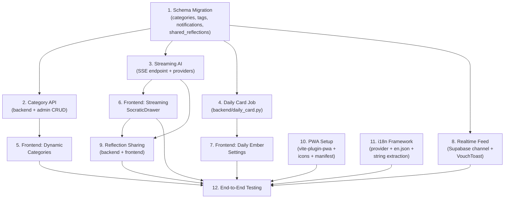

# Phase 4: Feature Enhancements — Implementation Plan

> **Based on:** `proposal.md` §4.1–4.7  
> **Codebase reviewed:** `backend/main.py`, `backend/admin.py`, `backend/auth.py`, `frontend/src/`, `supabase/schema.sql`  
> **Date:** September 2026

---

## Current State Assessment

Before building, here's what exists and what's missing:

| Layer | What Exists | What's Missing for Phase 4 |
|---|---|---|
| **Backend (`main.py`)** | Socratic reflection endpoint (`/api/socratic-reflect`) returns full response as JSON `{ reply }`. Uses `httpx.AsyncClient` with 60s timeout for OpenAI, Anthropic, Gemini. No streaming. Auth module (`auth.py`) and admin router (`admin.py`) from Phase 3. | Streaming SSE endpoint. Daily card cron/scheduler. Categories CRUD API. Reflection sharing endpoints. |
| **Frontend** | 5 tabs (deck, vault, discovery, account, admin). `@supabase/supabase-js` v2, `motion`, `lucide-react`, `driver.js`. Tailwind CSS v4. Vite SPA. No service worker. No i18n. No Realtime subscriptions. | Supabase Realtime vouch listener. Streaming response rendering. PWA manifest + service worker. i18n framework. Sharing UI. Categories from DB. Push notification registration. |
| **Database** | `profiles`, `cards` (with `vouch_count`, `published`), `card_vouches`, `reflection_sessions`. Vouch count trigger on `card_vouches`. RLS policies. | `categories` table. `shared_reflections` table. Supabase Realtime enabled on `card_vouches`. Notification preferences on `profiles`. |
| **Categories** | Hardcoded as `LifeStage` union type in `types.ts` (7 categories + 'All Inquiries'). Used in `initialData.ts`, `DiscoveryView.tsx`, `DeckView.tsx`. | Dynamic categories from a `categories` table. Admin CRUD for categories. Frontend fetches categories at startup. |
| **AI Providers** | 3 providers (OpenAI, Anthropic, Gemini). All use raw `httpx` HTTP calls — no SDKs. Non-streaming: full response returned as string. | Streaming variants of each provider using SSE. Reflection summary generation. Multi-card reflection already partially supported (accepts `cards: list`). |
| **PWA** | Basic `favicon.svg` in `public/`. Vite SPA with no manifest, no service worker, no offline support. | `manifest.json`, service worker (via `vite-plugin-pwa`), offline card cache, install prompt. |

---

## Architecture Decisions

1. **Streaming uses Server-Sent Events (SSE)** via FastAPI's `StreamingResponse`. A new endpoint `/api/socratic-reflect-stream` avoids breaking the existing non-streaming endpoint. Frontend uses the `EventSource` API (or `fetch` with `ReadableStream`).
2. **Categories become database-driven**. A new `categories` table replaces the hardcoded `LifeStage` type. The frontend fetches categories on app load and caches them. The `LifeStage` type becomes `string` (dynamic).
3. **Supabase Realtime** is used for the community vouch feed. The frontend subscribes to `INSERT` events on `card_vouches` via Supabase's channel API. No backend changes needed — Supabase handles the pub/sub.
4. **PWA is implemented via `vite-plugin-pwa`** — the most common Vite PWA plugin. It auto-generates the service worker and manifest from config.
5. **i18n uses a lightweight custom solution** (JSON translation files + React Context) rather than a heavy library like `react-i18next`, given the app's small surface area.
6. **Daily Card notifications** use a backend cron job (via Render's cron jobs or APScheduler) + Resend email API (already configured for auth codes).
7. **Reflection sharing** stores shared reflections in a new `shared_reflections` table with a shareable UUID slug. A public endpoint serves shared reflections without auth.

---

## Feature Implementation Order

> [!IMPORTANT]
> Features are ordered by priority from the proposal's recommended order, with dependencies resolved. Features 4.2 (Categories) and 4.5 (Streaming AI) deliver the most user value for medium effort and should be built first.

| Order | Feature | Proposal § | Priority | Effort | Dependencies |
|---|---|---|---|---|---|
| 1 | Configurable Categories & Tags | 4.2 | 🟡 Medium | Medium | None |
| 2 | Streaming AI Responses + Summaries | 4.5 | 🟡 Medium | Medium–Large | None |
| 3 | Daily Card Notifications | 4.4 | 🟡 Medium | Medium | Email (already exists) |
| 4 | Real-Time Community Vouch Feed | 4.1 | 🟢 Low | Medium | None |
| 5 | Progressive Web App (PWA) | 4.6 | 🟢 Low | Small | None |
| 6 | Reflection Sharing & Public Journals | 4.3 | 🟢 Low | Large | Streaming AI (nicer UX) |
| 7 | Internationalization (i18n) | 4.7 | 🟢 Low | Medium | None |

---

## Step-by-Step Implementation

### Step 1 — Configurable Categories & Tags (§4.2)

#### 1A — Database: `categories` Table

**File:** `supabase/migrations/004_phase4_features.sql`

```sql
-- =============================================
-- Categories table (replaces hardcoded LifeStage)
-- =============================================
CREATE TABLE IF NOT EXISTS public.categories (
  id uuid PRIMARY KEY DEFAULT gen_random_uuid(),
  name text NOT NULL UNIQUE,
  slug text NOT NULL UNIQUE,            -- URL-friendly identifier
  description text DEFAULT '',
  color text DEFAULT '#6366f1',          -- hex color for UI badges
  sort_order integer NOT NULL DEFAULT 0, -- controls display order
  active boolean NOT NULL DEFAULT true,  -- soft-delete/hide
  created_at timestamptz NOT NULL DEFAULT now()
);

-- Seed existing hardcoded categories
INSERT INTO public.categories (name, slug, sort_order) VALUES
  ('Existential Inquiry',   'existential-inquiry',   1),
  ('Solitude & Identity',   'solitude-identity',      2),
  ('Career Reinvention',    'career-reinvention',     3),
  ('Mortality & Meaning',   'mortality-meaning',      4),
  ('Creativity & Craft',    'creativity-craft',       5),
  ('Deep Relationships',    'deep-relationships',     6),
  ('Midlife Reckoning',     'midlife-reckoning',      7)
ON CONFLICT (slug) DO NOTHING;

-- RLS: anyone can read active categories
ALTER TABLE public.categories ENABLE ROW LEVEL SECURITY;
CREATE POLICY "Anyone can read active categories"
  ON public.categories FOR SELECT
  USING (active = true);

-- Allow managers to manage categories (via service-role key, bypasses RLS)

-- =============================================
-- Card-tag junction table (many-to-many)
-- =============================================
CREATE TABLE IF NOT EXISTS public.card_tags (
  card_id text NOT NULL REFERENCES public.cards(id) ON DELETE CASCADE,
  tag text NOT NULL,
  created_at timestamptz NOT NULL DEFAULT now(),
  PRIMARY KEY (card_id, tag)
);

CREATE INDEX IF NOT EXISTS idx_card_tags_tag ON public.card_tags (tag);

ALTER TABLE public.card_tags ENABLE ROW LEVEL SECURITY;
CREATE POLICY "Anyone can read card tags"
  ON public.card_tags FOR SELECT USING (true);

-- =============================================
-- User-suggested tags (pending approval)
-- =============================================
CREATE TABLE IF NOT EXISTS public.suggested_tags (
  id uuid PRIMARY KEY DEFAULT gen_random_uuid(),
  card_id text NOT NULL REFERENCES public.cards(id) ON DELETE CASCADE,
  tag text NOT NULL,
  suggested_by uuid REFERENCES auth.users(id) ON DELETE SET NULL,
  status text NOT NULL DEFAULT 'pending' CHECK (status IN ('pending', 'approved', 'rejected')),
  created_at timestamptz NOT NULL DEFAULT now(),
  UNIQUE (card_id, tag, suggested_by)
);
```

#### 1B — Backend: Category API

**File:** `backend/admin.py` (add to existing router)

```
GET    /api/categories                          — Public: list all active categories
POST   /api/admin/categories                    — Create a category (manager only)
PATCH  /api/admin/categories/{category_id}      — Update category (manager only)
DELETE /api/admin/categories/{category_id}      — Deactivate category (manager only)
GET    /api/admin/suggested-tags                — List pending tag suggestions (manager only)
PATCH  /api/admin/suggested-tags/{id}           — Approve/reject tag suggestion (manager only)
POST   /api/cards/{card_id}/suggest-tag         — User suggests a tag for a card
```

**Pydantic Models:**

```python
class CategoryCreate(BaseModel):
    name: str
    slug: str | None = None          # auto-generated from name if omitted
    description: str = ""
    color: str = "#6366f1"
    sort_order: int = 0

class CategoryUpdate(BaseModel):
    name: str | None = None
    description: str | None = None
    color: str | None = None
    sort_order: int | None = None
    active: bool | None = None

class TagSuggestion(BaseModel):
    tag: str   # max 30 chars, lowercase, trimmed
```

#### 1C — Frontend: Dynamic Categories

**Key changes:**

| File | Change |
|---|---|
| `types.ts` | Replace `LifeStage` union type with `string`. Add `Category` interface with `id`, `name`, `slug`, `color`, `sortOrder`. |
| `lib/api.ts` | Add `fetchCategories()` → `GET /api/categories`. Cache result in state. |
| `App.tsx` | Fetch categories on mount. Pass to components via props or Context. |
| `DeckView.tsx` | Filter buttons use dynamic category list instead of hardcoded values. |
| `DiscoveryView.tsx` | Category dropdown in card creation form populated from DB. |
| `AdminView.tsx` | Add category management sub-tab: CRUD table for categories + tag approval queue. |
| `data/initialData.ts` | Remove hardcoded category references (seed cards already in Supabase). |

> [!WARNING]
> Changing `LifeStage` from a union type to `string` is a breaking type change. All components that reference specific `LifeStage` literals (e.g., filter comparisons) must be updated to compare against dynamic category names.

**Checklist:**
- [ ] Write migration `004_phase4_features.sql` — categories, card_tags, suggested_tags tables
- [ ] Run migration against Supabase
- [ ] Add `GET /api/categories` public endpoint (in `main.py` or a new `categories.py` router)
- [ ] Add admin category CRUD endpoints to `admin.py`
- [ ] Add tag suggestion endpoints
- [ ] Update `types.ts`: `LifeStage` → `string`, add `Category` interface
- [ ] Add `fetchCategories()` to `api.ts`
- [ ] Fetch categories on app mount in `App.tsx`
- [ ] Update `DeckView.tsx` filter buttons to use dynamic categories
- [ ] Update `DiscoveryView.tsx` card creation form
- [ ] Add category management UI to `AdminView.tsx`
- [ ] Add tag suggestion UI (user side: suggest button on card; admin side: approval queue)

---

### Step 2 — Streaming AI Responses & Summaries (§4.5)

#### 2A — Backend: Streaming Endpoint

**File:** `backend/main.py`

Add a new streaming endpoint alongside the existing one:

```
POST /api/socratic-reflect-stream  — SSE streaming Socratic reflection
```

**Implementation approach:**

```python
from fastapi.responses import StreamingResponse

@app.post("/api/socratic-reflect-stream")
async def socratic_reflect_stream(req: SocraticReflectRequest):
    """Stream Socratic reflection responses via Server-Sent Events."""
    # ... same validation as /api/socratic-reflect ...

    async def event_generator():
        async with httpx.AsyncClient() as client:
            if provider == "openai":
                async for chunk in stream_openai(client, api_key, model, system_prompt, messages):
                    yield f"data: {json.dumps({'chunk': chunk})}\n\n"
            elif provider == "anthropic":
                async for chunk in stream_anthropic(client, api_key, model, system_prompt, messages):
                    yield f"data: {json.dumps({'chunk': chunk})}\n\n"
            else:
                async for chunk in stream_gemini(client, api_key, model, system_prompt, messages):
                    yield f"data: {json.dumps({'chunk': chunk})}\n\n"
        yield f"data: {json.dumps({'done': True})}\n\n"

    return StreamingResponse(
        event_generator(),
        media_type="text/event-stream",
        headers={"Cache-Control": "no-cache", "X-Accel-Buffering": "no"}
    )
```

**Streaming provider functions:**

```python
async def stream_openai(client, api_key, model, system_prompt, messages):
    """Yield text chunks from OpenAI streaming API."""
    payload = {
        "model": model,
        "messages": [{"role": "system", "content": system_prompt}] +
                    [{"role": "assistant" if m.role == "model" else "user", "content": m.content} for m in messages],
        "stream": True,
    }
    async with client.stream("POST", "https://api.openai.com/v1/chat/completions",
                              headers={"Authorization": f"Bearer {api_key}", "Content-Type": "application/json"},
                              json=payload, timeout=120.0) as response:
        async for line in response.aiter_lines():
            if line.startswith("data: ") and line != "data: [DONE]":
                data = json.loads(line[6:])
                delta = data.get("choices", [{}])[0].get("delta", {}).get("content", "")
                if delta:
                    yield delta

async def stream_anthropic(client, api_key, model, system_prompt, messages):
    """Yield text chunks from Anthropic streaming API."""
    payload = {
        "model": model,
        "max_tokens": 700,
        "system": system_prompt,
        "messages": [{"role": "assistant" if m.role == "model" else "user", "content": m.content} for m in messages],
        "stream": True,
    }
    headers = {
        "x-api-key": api_key,
        "anthropic-version": "2023-06-01",
        "Content-Type": "application/json",
    }
    async with client.stream("POST", "https://api.anthropic.com/v1/messages",
                              headers=headers, json=payload, timeout=120.0) as response:
        async for line in response.aiter_lines():
            if line.startswith("data: "):
                data = json.loads(line[6:])
                if data.get("type") == "content_block_delta":
                    text = data.get("delta", {}).get("text", "")
                    if text:
                        yield text

async def stream_gemini(client, api_key, model, system_prompt, messages):
    """Yield text chunks from Gemini streaming API."""
    formatted_contents = [{"role": "model" if m.role == "model" else "user",
                           "parts": [{"text": m.content}]} for m in messages]
    payload = {
        "systemInstruction": {"parts": [{"text": system_prompt}]},
        "contents": formatted_contents,
    }
    url = (f"https://generativelanguage.googleapis.com/v1beta/models/"
           f"{urllib.parse.quote(model)}:streamGenerateContent"
           f"?key={urllib.parse.quote(api_key)}&alt=sse")

    async with client.stream("POST", url,
                              headers={"Content-Type": "application/json"},
                              json=payload, timeout=120.0) as response:
        async for line in response.aiter_lines():
            if line.startswith("data: "):
                data = json.loads(line[6:])
                candidates = data.get("candidates", [])
                if candidates:
                    parts = candidates[0].get("content", {}).get("parts", [])
                    for part in parts:
                        text = part.get("text", "")
                        if text:
                            yield text
```

#### 2B — Backend: Reflection Summary Generation

**File:** `backend/main.py`

```
POST /api/socratic-reflect-summary  — Generate insight summary after ≥5 turns
```

```python
@app.post("/api/socratic-reflect-summary")
async def socratic_reflect_summary(req: SocraticReflectRequest):
    """Generate a concise insight summary from a completed reflection."""
    # Reuse same provider setup, but with a summary-focused system prompt:
    summary_prompt = (
        "Review this Socratic reflection conversation. "
        "Produce a concise summary (3-5 sentences) of the key insights, "
        "patterns of thinking, and any shifts in perspective that emerged. "
        "Write in second person ('You explored...', 'You realized...')."
    )
    # ... call provider with conversation history + summary prompt ...
    return {"summary": reply}
```

#### 2C — Frontend: Streaming Rendering

**File:** `frontend/src/components/SocraticDrawer.tsx`

| Change | Details |
|---|---|
| Add streaming mode toggle | Default to streaming ON. Fallback to non-streaming if SSE fails. |
| Stream rendering | Use `fetch()` with `ReadableStream` to read SSE chunks. Append text to current message state as chunks arrive. |
| Typing indicator | Replace loading spinner with "typing..." dots that transition to streamed text. |
| Summary button | After 5+ turns, show "Generate Summary" button. Calls `/api/socratic-reflect-summary`. Displays summary in a styled card at the bottom of the conversation. |

**Streaming fetch pattern (frontend):**

```typescript
async function streamReflection(body: SocraticReflectRequest, onChunk: (text: string) => void) {
  const response = await fetch('/api/socratic-reflect-stream', {
    method: 'POST',
    headers: { 'Content-Type': 'application/json' },
    body: JSON.stringify(body),
  });

  const reader = response.body?.getReader();
  const decoder = new TextDecoder();

  while (reader) {
    const { done, value } = await reader.read();
    if (done) break;
    const text = decoder.decode(value, { stream: true });
    // Parse SSE lines
    for (const line of text.split('\n')) {
      if (line.startsWith('data: ')) {
        const data = JSON.parse(line.slice(6));
        if (data.chunk) onChunk(data.chunk);
        if (data.done) return;
      }
    }
  }
}
```

**Checklist:**
- [ ] Add `stream_openai()`, `stream_anthropic()`, `stream_gemini()` async generators to `main.py`
- [ ] Add `POST /api/socratic-reflect-stream` SSE endpoint
- [ ] Add `POST /api/socratic-reflect-summary` endpoint
- [ ] Update `SocraticDrawer.tsx` to use streaming fetch
- [ ] Implement progressive text rendering (append chunks to message state)
- [ ] Add typing indicator animation during streaming
- [ ] Add "Generate Summary" button (visible after 5+ turns)
- [ ] Display summary card in reflection conversation
- [ ] Keep non-streaming endpoint as fallback
- [ ] Test streaming with all 3 providers

---

### Step 3 — Daily Card Notifications (§4.4)

#### 3A — Database: Notification Preferences

**File:** `supabase/migrations/004_phase4_features.sql` (append)

```sql
-- =============================================
-- Notification preferences
-- =============================================
ALTER TABLE public.profiles
  ADD COLUMN IF NOT EXISTS daily_card_enabled boolean NOT NULL DEFAULT false,
  ADD COLUMN IF NOT EXISTS daily_card_hour integer NOT NULL DEFAULT 8
    CHECK (daily_card_hour >= 0 AND daily_card_hour <= 23),
  ADD COLUMN IF NOT EXISTS timezone text NOT NULL DEFAULT 'UTC';

-- Track sent notifications to avoid duplicates
CREATE TABLE IF NOT EXISTS public.daily_card_log (
  id uuid PRIMARY KEY DEFAULT gen_random_uuid(),
  user_id uuid NOT NULL REFERENCES auth.users(id) ON DELETE CASCADE,
  card_id text NOT NULL REFERENCES public.cards(id) ON DELETE CASCADE,
  sent_at timestamptz NOT NULL DEFAULT now(),
  opened boolean NOT NULL DEFAULT false
);

CREATE INDEX IF NOT EXISTS idx_daily_card_log_user ON public.daily_card_log (user_id, sent_at DESC);
```

#### 3B — Backend: Daily Card Cron Job

**New file:** `backend/daily_card.py`

```python
"""
Daily Card ("Daily Ember") notification job.
Runs as a cron job on Render: `python -m daily_card`
"""
import os, random, logging
from datetime import datetime, timezone
from supabase import create_client
import httpx

logger = logging.getLogger(__name__)

def get_eligible_users(db) -> list[dict]:
    """Fetch users who opted into daily cards and haven't received one today."""
    # Query profiles where daily_card_enabled = True
    # LEFT JOIN daily_card_log to check if sent today
    result = db.rpc("get_daily_card_eligible_users").execute()
    return result.data or []

def pick_card_for_user(db, user_id: str) -> dict | None:
    """Pick a published card the user hasn't received recently."""
    # Get recently sent card IDs (last 30 days)
    recent = db.table("daily_card_log") \
        .select("card_id") \
        .eq("user_id", user_id) \
        .order("sent_at", desc=True) \
        .limit(30) \
        .execute()
    recent_ids = {r["card_id"] for r in (recent.data or [])}

    # Get all published cards
    cards = db.table("cards") \
        .select("id, question, author, category") \
        .eq("published", True) \
        .execute()
    available = [c for c in (cards.data or []) if c["id"] not in recent_ids]

    if not available:
        # Fallback: allow repeats
        available = cards.data or []

    return random.choice(available) if available else None

async def send_daily_email(email: str, card: dict):
    """Send daily card email via Resend API."""
    resend_key = os.getenv("RESEND_API_KEY")
    resend_from = os.getenv("RESEND_FROM_EMAIL")
    app_url = os.getenv("FRONTEND_URL", "https://plenary.app")

    html = f"""
    <div style="font-family: serif; max-width: 480px; margin: 0 auto; padding: 24px;">
      <h2 style="color: #4f46e5;">Your Daily Ember 🔥</h2>
      <blockquote style="border-left: 3px solid #6366f1; padding-left: 16px; font-size: 18px; color: #1f2937;">
        "{card['question']}"
      </blockquote>
      <p style="color: #6b7280;">— {card['author']}, {card.get('category', '')}</p>
      <a href="{app_url}" style="display: inline-block; margin-top: 16px; padding: 10px 20px;
         background: #4f46e5; color: white; text-decoration: none; border-radius: 8px;">
        Reflect on this question →
      </a>
    </div>
    """

    async with httpx.AsyncClient() as client:
        await client.post(
            "https://api.resend.com/emails",
            headers={"Authorization": f"Bearer {resend_key}", "Content-Type": "application/json"},
            json={
                "from": resend_from,
                "to": email,
                "subject": f"Daily Ember: \"{card['question'][:60]}...\"",
                "html": html,
            },
            timeout=30.0,
        )
```

**Render Cron Configuration:**

Add to `render.yaml`:

```yaml
- type: cron
  name: plenary-daily-card
  schedule: "0 * * * *"   # Run every hour, job checks per-user timezone
  buildCommand: pip install -r requirements.txt
  startCommand: python -m daily_card
  envVars:
    - fromGroup: plenary-env
```

> [!TIP]
> The cron runs hourly but only sends to users whose `daily_card_hour` matches the current hour in their configured timezone. This avoids sending emails at 3 AM.

#### 3C — Frontend: Notification Preferences UI

**File:** `frontend/src/components/AccountView.tsx`

Add a "Daily Ember" settings section:

| Setting | UI Element | Details |
|---|---|---|
| Enable/Disable | Toggle switch | Updates `profiles.daily_card_enabled` |
| Preferred Time | Hour picker (dropdown, 12h format) | Updates `profiles.daily_card_hour` |
| Timezone | Auto-detected from browser, with override dropdown | Uses `Intl.DateTimeFormat().resolvedOptions().timeZone` |

**Checklist:**
- [ ] Add notification columns to `profiles` in migration
- [ ] Create `daily_card_log` table
- [ ] Create Postgres function `get_daily_card_eligible_users()`
- [ ] Create `backend/daily_card.py` cron job script
- [ ] Implement card selection logic (avoid recent repeats)
- [ ] Implement email sending via Resend
- [ ] Add cron configuration to `render.yaml`
- [ ] Add "Daily Ember" settings section to `AccountView.tsx`
- [ ] Add API endpoint `PATCH /api/profile/notifications` for preference updates
- [ ] Test email delivery with Resend
- [ ] Test timezone-aware scheduling

---

### Step 4 — Real-Time Community Vouch Feed (§4.1)

#### 4A — Enable Supabase Realtime on `card_vouches`

**File:** `supabase/migrations/004_phase4_features.sql` (append)

```sql
-- Enable Realtime on card_vouches table
-- (Done via Supabase Dashboard > Database > Replication > card_vouches, 
--  or programmatically:)
ALTER PUBLICATION supabase_realtime ADD TABLE public.card_vouches;
```

> [!NOTE]
> No backend changes needed. Supabase Realtime works directly with the frontend Supabase client. The frontend subscribes to `INSERT` events on `card_vouches` and shows toast notifications.

#### 4B — Frontend: Realtime Subscription

**New file:** `frontend/src/hooks/useVouchFeed.ts`

```typescript
import { useEffect, useRef, useState } from 'react';
import { supabase } from '../lib/supabase';

interface VouchEvent {
  cardId: string;
  cardQuestion: string;
  cardAuthor: string;
  vouchCount: number;
  timestamp: string;
}

export function useVouchFeed(enabled: boolean = true) {
  const [latestVouch, setLatestVouch] = useState<VouchEvent | null>(null);
  const channelRef = useRef<ReturnType<typeof supabase.channel> | null>(null);

  useEffect(() => {
    if (!enabled) return;

    const channel = supabase
      .channel('vouch-feed')
      .on(
        'postgres_changes',
        { event: 'INSERT', schema: 'public', table: 'card_vouches' },
        async (payload) => {
          const cardId = payload.new.card_id;
          // Fetch card details for the toast
          const { data: card } = await supabase
            .from('cards')
            .select('question, author, vouch_count')
            .eq('id', cardId)
            .single();

          if (card) {
            setLatestVouch({
              cardId,
              cardQuestion: card.question,
              cardAuthor: card.author,
              vouchCount: card.vouch_count,
              timestamp: new Date().toISOString(),
            });
          }
        }
      )
      .subscribe();

    channelRef.current = channel;

    return () => {
      channel.unsubscribe();
    };
  }, [enabled]);

  return latestVouch;
}
```

#### 4C — Frontend: Toast Component

**New file:** `frontend/src/components/VouchToast.tsx`

A soft, auto-dismissing toast notification:

```
┌─────────────────────────────────────────────────────┐
│ 🔥 Someone just vouched for "What would you        │
│    attempt..." — 43 voyagers and counting.          │
└─────────────────────────────────────────────────────┘
```

| Behavior | Details |
|---|---|
| Appears | Bottom-center of screen, above bottom nav |
| Animation | Slide up + fade in (use `motion` library, already installed) |
| Duration | Auto-dismiss after 4 seconds |
| Debounce | If multiple vouches arrive within 2 seconds, show only the latest |
| Dismiss | Tap/click to dismiss immediately |
| Opt-out | Toggle in Account settings to disable live feed |

**Checklist:**
- [ ] Enable Supabase Realtime on `card_vouches` (via Dashboard or migration)
- [ ] Create `useVouchFeed.ts` hook with Realtime subscription
- [ ] Create `VouchToast.tsx` component with animation
- [ ] Integrate toast into `App.tsx` (render above bottom nav)
- [ ] Add debounce logic (2s window)
- [ ] Add auto-dismiss (4s timeout)
- [ ] Add opt-out toggle in Account settings
- [ ] Exclude own vouches from feed (compare `user_id` with current user)
- [ ] Test with multiple browser tabs

---

### Step 5 — Progressive Web App (§4.6)

#### 5A — Install `vite-plugin-pwa`

```bash
npm install -D vite-plugin-pwa
```

#### 5B — Configure Vite Plugin

**File:** `frontend/vite.config.ts`

```typescript
import { VitePWA } from 'vite-plugin-pwa';

export default defineConfig(() => ({
  plugins: [
    react(),
    tailwindcss(),
    VitePWA({
      registerType: 'autoUpdate',
      includeAssets: ['favicon.svg', 'assets/**/*'],
      manifest: {
        name: 'Plenary — Inquiry Deck',
        short_name: 'Plenary',
        description: 'A Socratic inquiry deck for deep thinkers',
        theme_color: '#0f0f23',
        background_color: '#0f0f23',
        display: 'standalone',
        start_url: '/',
        scope: '/',
        icons: [
          { src: '/assets/icon-192.png', sizes: '192x192', type: 'image/png' },
          { src: '/assets/icon-512.png', sizes: '512x512', type: 'image/png' },
          { src: '/assets/icon-512.png', sizes: '512x512', type: 'image/png', purpose: 'maskable' },
        ],
      },
      workbox: {
        globPatterns: ['**/*.{js,css,html,svg,png,woff2}'],
        runtimeCaching: [
          {
            // Cache card data for offline viewing
            urlPattern: /\/api\/bootstrap/,
            handler: 'NetworkFirst',
            options: {
              cacheName: 'card-data',
              expiration: { maxAgeSeconds: 86400 }, // 24h
            },
          },
          {
            // Cache avatar images
            urlPattern: /\.(?:png|jpg|jpeg|svg|webp)$/,
            handler: 'CacheFirst',
            options: {
              cacheName: 'images',
              expiration: { maxEntries: 100, maxAgeSeconds: 604800 }, // 7 days
            },
          },
        ],
      },
    }),
  ],
  // ... rest of existing config
}));
```

#### 5C — App Icons

Create PWA icons in `frontend/public/assets/`:
- `icon-192.png` — 192×192 app icon
- `icon-512.png` — 512×512 app icon (also used as maskable)
- `apple-touch-icon.png` — 180×180 for iOS

#### 5D — Install Prompt

**New file:** `frontend/src/hooks/useInstallPrompt.ts`

Capture the `beforeinstallprompt` event and expose a button in Account settings:

```typescript
export function useInstallPrompt() {
  const [deferredPrompt, setDeferredPrompt] = useState<BeforeInstallPromptEvent | null>(null);
  const [isInstallable, setIsInstallable] = useState(false);

  useEffect(() => {
    const handler = (e: Event) => {
      e.preventDefault();
      setDeferredPrompt(e as BeforeInstallPromptEvent);
      setIsInstallable(true);
    };
    window.addEventListener('beforeinstallprompt', handler);
    return () => window.removeEventListener('beforeinstallprompt', handler);
  }, []);

  const install = async () => {
    if (deferredPrompt) {
      deferredPrompt.prompt();
      const result = await deferredPrompt.userChoice;
      if (result.outcome === 'accepted') setIsInstallable(false);
      setDeferredPrompt(null);
    }
  };

  return { isInstallable, install };
}
```

**Checklist:**
- [ ] Install `vite-plugin-pwa`
- [ ] Configure PWA plugin in `vite.config.ts`
- [ ] Create app icons (192, 512, apple-touch)
- [ ] Add `<meta name="apple-mobile-web-app-capable">` and `<meta name="theme-color">` to `index.html`
- [ ] Create `useInstallPrompt.ts` hook
- [ ] Add "Install Plenary" button in `AccountView.tsx` (visible when installable)
- [ ] Configure Workbox caching: card data (NetworkFirst), images (CacheFirst)
- [ ] Test offline card viewing
- [ ] Test add-to-homescreen on Android and iOS
- [ ] Verify service worker update flow

---

### Step 6 — Reflection Sharing & Public Journals (§4.3)

#### 6A — Database: Shared Reflections

**File:** `supabase/migrations/004_phase4_features.sql` (append)

```sql
-- =============================================
-- Shared reflections (public journals)
-- =============================================
CREATE TABLE IF NOT EXISTS public.shared_reflections (
  id uuid PRIMARY KEY DEFAULT gen_random_uuid(),
  slug text NOT NULL UNIQUE DEFAULT encode(gen_random_bytes(8), 'hex'),
  user_id uuid NOT NULL REFERENCES auth.users(id) ON DELETE CASCADE,
  card_id text NOT NULL REFERENCES public.cards(id) ON DELETE CASCADE,
  messages jsonb NOT NULL DEFAULT '[]'::jsonb,  -- snapshot of chat messages
  summary text,                                  -- AI-generated summary
  anonymous boolean NOT NULL DEFAULT false,      -- hide author identity
  published boolean NOT NULL DEFAULT true,
  created_at timestamptz NOT NULL DEFAULT now(),
  view_count integer NOT NULL DEFAULT 0
);

CREATE INDEX IF NOT EXISTS idx_shared_reflections_slug ON public.shared_reflections (slug);
CREATE INDEX IF NOT EXISTS idx_shared_reflections_published ON public.shared_reflections (published, created_at DESC);

ALTER TABLE public.shared_reflections ENABLE ROW LEVEL SECURITY;

-- Anyone can read published shared reflections
CREATE POLICY "Anyone can read published shared reflections"
  ON public.shared_reflections FOR SELECT
  USING (published = true);

-- Users can insert/update/delete their own
CREATE POLICY "Users can manage own shared reflections"
  ON public.shared_reflections FOR ALL
  USING (auth.uid() = user_id);
```

#### 6B — Backend: Sharing Endpoints

**File:** `backend/main.py` (or new `backend/sharing.py` router)

```
POST   /api/reflections/share              — Share a reflection (creates slug)
GET    /api/shared/{slug}                  — Public: view shared reflection (no auth)
DELETE /api/reflections/share/{id}         — Unshare a reflection
GET    /api/reflections/shared-feed        — Public: browse community reflections
PATCH  /api/reflections/share/{id}         — Toggle anonymous/published
```

**Pydantic Models:**

```python
class ShareReflectionRequest(BaseModel):
    card_id: str
    messages: list[dict]           # snapshot of the chat
    summary: str | None = None
    anonymous: bool = False

class SharedReflectionResponse(BaseModel):
    id: str
    slug: str
    card: dict                     # card question, author, category
    messages: list[dict]
    summary: str | None
    author: str | None             # None if anonymous
    created_at: str
    view_count: int

class SharedFeedParams(BaseModel):
    page: int = 1
    per_page: int = 20
    category: str | None = None
```

#### 6C — Frontend: Sharing UI

**File:** `frontend/src/components/SocraticDrawer.tsx`

Add a "Share Reflection" button after conversation ends or at any point:

| Feature | UI Element | Details |
|---|---|---|
| Share Button | Icon button in drawer header | Opens share options modal |
| Options | Checkboxes | "Share anonymously", "Include AI summary" |
| Result | Copy-link modal | Shows shareable URL: `plenary.app/r/{slug}` |
| Shared Badge | Icon on shared reflections in history | Indicates which reflections are public |

**New file:** `frontend/src/components/SharedReflectionView.tsx`

A public page that renders a shared reflection:
- Card question + author as header
- Chat messages rendered read-only
- AI summary if available
- Author attribution (or "Anonymous Voyager")
- View count
- "Start your own reflection" CTA button

**New file:** `frontend/src/components/CommunityFeed.tsx`

A browsable feed of shared reflections (integrated into Discovery tab or as new sub-tab):
- Card grid showing shared reflections
- Filter by category
- Sort by recent / most viewed

**Checklist:**
- [ ] Create `shared_reflections` table in migration
- [ ] Add sharing endpoints to backend
- [ ] Add "Share" button in `SocraticDrawer.tsx`
- [ ] Create sharing options modal
- [ ] Create `SharedReflectionView.tsx` for public viewing
- [ ] Create `CommunityFeed.tsx` for browsing shared reflections
- [ ] Add URL routing for `/r/{slug}` (or handle via query params in SPA)
- [ ] Implement view count increment on public view
- [ ] Add shared badge to reflection history
- [ ] Test anonymous vs attributed sharing
- [ ] Admin: add shared reflection moderation to `AdminView.tsx`

---

### Step 7 — Internationalization / i18n (§4.7)

#### 7A — Translation File Structure

**New directory:** `frontend/src/i18n/`

```
frontend/src/i18n/
├── index.ts          — i18n Context provider + useTranslation hook
├── en.json           — English translations (source of truth)
├── fa.json           — Farsi translations (example)
└── es.json           — Spanish translations (example)
```

**Translation file format (`en.json`):**

```json
{
  "nav": {
    "deck": "Deck",
    "vault": "Vault",
    "discovery": "Discovery",
    "account": "Account",
    "admin": "Admin"
  },
  "deck": {
    "swipe_hint": "Swipe through the deck to explore",
    "no_cards": "No cards match your filters",
    "vouch_hold": "Hold for 3 seconds to vouch"
  },
  "vault": {
    "title": "Your Vault",
    "empty": "Your vault is waiting. Explore the deck and hold on a question that moves you.",
    "search_placeholder": "Search your vouched cards...",
    "no_results": "No cards match your search. Try a different phrase."
  },
  "vouch": {
    "toast": "Someone just vouched for \"{question}\" — {count} voyagers and counting.",
    "button_hold": "Hold to vouch",
    "button_vouched": "Vouched"
  },
  "reflection": {
    "start": "Start Reflection",
    "generate_summary": "Generate Summary",
    "share": "Share Reflection",
    "empty": "Start your first reflection to see it here."
  },
  "account": {
    "sign_in": "Sign In",
    "sign_out": "Sign Out",
    "daily_ember": "Daily Ember",
    "install_app": "Install Plenary",
    "language": "Language",
    "replay_tour": "Replay Tour"
  },
  "common": {
    "loading": "Loading...",
    "error": "Something went wrong",
    "save": "Save",
    "cancel": "Cancel",
    "delete": "Delete",
    "confirm": "Are you sure?"
  }
}
```

#### 7B — i18n Provider (Lightweight Custom)

**File:** `frontend/src/i18n/index.ts`

```typescript
import { createContext, useContext } from 'react';
import en from './en.json';

type Translations = typeof en;
type TranslationKey = string; // dot-notation: "vault.empty"

interface I18nContextValue {
  locale: string;
  t: (key: TranslationKey, vars?: Record<string, string | number>) => string;
  setLocale: (locale: string) => void;
  availableLocales: { code: string; name: string }[];
}

// Lazy-load translation files
const translationLoaders: Record<string, () => Promise<Translations>> = {
  en: () => Promise.resolve(en),
  fa: () => import('./fa.json').then(m => m.default),
  es: () => import('./es.json').then(m => m.default),
};

function resolve(obj: any, path: string): string {
  return path.split('.').reduce((o, k) => o?.[k], obj) ?? path;
}

function interpolate(template: string, vars?: Record<string, string | number>): string {
  if (!vars) return template;
  return template.replace(/\{(\w+)\}/g, (_, k) => String(vars[k] ?? `{${k}}`));
}

// Hook: const { t } = useTranslation();
// Usage: t('vault.empty') → "Your vault is waiting..."
// Usage: t('vouch.toast', { question: '...', count: 43 })
```

#### 7C — Integration

| File | Change |
|---|---|
| `App.tsx` | Wrap app in `<I18nProvider>`. Read locale from `localStorage` or browser default. |
| All components | Replace hardcoded English strings with `t('key')` calls. |
| `AccountView.tsx` | Add language picker dropdown. |

> [!NOTE]
> Card content (questions, backstories, author bios) remains in English. Only UI chrome — buttons, labels, tooltips, empty states, and system messages — is translated.

**Checklist:**
- [ ] Create `frontend/src/i18n/` directory with `index.ts` and `en.json`
- [ ] Implement `I18nProvider` Context + `useTranslation` hook
- [ ] Extract all hardcoded UI strings from components into `en.json`
- [ ] Wrap `App.tsx` in `<I18nProvider>`
- [ ] Add language picker to `AccountView.tsx`
- [ ] Persist locale in `localStorage`
- [ ] Create at least one additional translation file (e.g., `fa.json`)
- [ ] Lazy-load non-English translation files
- [ ] Test RTL layout support if adding RTL languages (Farsi)
- [ ] Document translation contribution process in README

---

## File Change Summary

| Action | File | Feature | Description |
|---|---|---|---|
| **CREATE** | `supabase/migrations/004_phase4_features.sql` | All | Categories, card_tags, suggested_tags, notification prefs, daily_card_log, shared_reflections tables |
| **MODIFY** | `backend/main.py` | §4.5 | Add streaming endpoint, streaming provider functions, summary endpoint |
| **MODIFY** | `backend/admin.py` | §4.2 | Add category CRUD + tag approval endpoints |
| **CREATE** | `backend/daily_card.py` | §4.4 | Daily card cron job |
| **MODIFY** | `backend/render.yaml` | §4.4 | Add cron job configuration |
| **MODIFY** | `frontend/src/types.ts` | §4.2 | `LifeStage` → dynamic string, add `Category` interface |
| **MODIFY** | `frontend/src/lib/api.ts` | §4.2, §4.3, §4.5 | Add category fetch, sharing, streaming API functions |
| **MODIFY** | `frontend/src/lib/supabase.ts` | §4.1 | No changes needed (Realtime via existing client) |
| **CREATE** | `frontend/src/hooks/useVouchFeed.ts` | §4.1 | Supabase Realtime vouch subscription hook |
| **CREATE** | `frontend/src/hooks/useInstallPrompt.ts` | §4.6 | PWA install prompt hook |
| **CREATE** | `frontend/src/components/VouchToast.tsx` | §4.1 | Community vouch feed toast component |
| **CREATE** | `frontend/src/components/SharedReflectionView.tsx` | §4.3 | Public shared reflection page |
| **CREATE** | `frontend/src/components/CommunityFeed.tsx` | §4.3 | Browsable shared reflections feed |
| **MODIFY** | `frontend/src/components/SocraticDrawer.tsx` | §4.5, §4.3 | Streaming rendering, summary button, share button |
| **MODIFY** | `frontend/src/components/AccountView.tsx` | §4.4, §4.6, §4.7 | Daily Ember settings, install button, language picker |
| **MODIFY** | `frontend/src/components/DeckView.tsx` | §4.2 | Dynamic category filters |
| **MODIFY** | `frontend/src/components/DiscoveryView.tsx` | §4.2 | Dynamic category dropdown in card form |
| **MODIFY** | `frontend/src/components/AdminView.tsx` | §4.2, §4.3 | Category management sub-tab, shared reflection moderation |
| **MODIFY** | `frontend/src/App.tsx` | §4.1, §4.2, §4.7 | Vouch toast integration, category context, i18n provider |
| **MODIFY** | `frontend/vite.config.ts` | §4.6 | PWA plugin configuration |
| **MODIFY** | `frontend/index.html` | §4.6 | PWA meta tags |
| **CREATE** | `frontend/src/i18n/index.ts` | §4.7 | i18n provider + useTranslation hook |
| **CREATE** | `frontend/src/i18n/en.json` | §4.7 | English translations |
| **CREATE** | `frontend/public/assets/icon-192.png` | §4.6 | PWA icon |
| **CREATE** | `frontend/public/assets/icon-512.png` | §4.6 | PWA icon |

---

## Suggested Build Order



> [!NOTE]
> Steps 2, 3, 4 can be built in parallel (all depend only on the migration). Steps 5, 6, 7, 8 can be built in parallel. Steps 10 (PWA) and 11 (i18n) are fully independent and can be done at any time.

---

## Testing & Verification Plan

### Backend Tests

**Categories API:**
- [ ] `GET /api/categories` returns only active categories
- [ ] `POST /api/admin/categories` creates category with slug auto-generation
- [ ] `PATCH /api/admin/categories/{id}` updates only provided fields
- [ ] `DELETE /api/admin/categories/{id}` soft-deletes (sets `active = false`)
- [ ] Category deletion doesn't remove cards (cards retain their category string)

**Streaming AI:**
- [ ] `POST /api/socratic-reflect-stream` returns `Content-Type: text/event-stream`
- [ ] SSE chunks arrive progressively (not buffered)
- [ ] OpenAI streaming works with `gpt-4o` and `gpt-4o-mini`
- [ ] Anthropic streaming works with `claude-sonnet-4-20250514`
- [ ] Gemini streaming works with `gemini-2.5-flash`
- [ ] Connection errors result in a final error SSE event, not a hang
- [ ] Summary endpoint produces coherent 3-5 sentence summaries

**Daily Card:**
- [ ] Cron job selects eligible users correctly
- [ ] Card selection avoids recently sent cards
- [ ] Email renders correctly (test with Resend)
- [ ] Duplicate sends are prevented (same user, same day)

**Sharing:**
- [ ] `POST /api/reflections/share` creates shareable slug
- [ ] `GET /api/shared/{slug}` returns reflection without auth
- [ ] Anonymous sharing hides user identity
- [ ] View count increments on each view
- [ ] `DELETE /api/reflections/share/{id}` removes shared reflection

### Frontend Tests

**Categories:**
- [ ] Categories load from API on app mount
- [ ] Deck filter buttons reflect database categories
- [ ] Card creation form shows dynamic category dropdown
- [ ] Admin can create, edit, and deactivate categories

**Streaming:**
- [ ] AI responses render word-by-word as chunks arrive
- [ ] Typing indicator shows during streaming
- [ ] User can't send another message while streaming is active
- [ ] Connection loss shows error message gracefully
- [ ] "Generate Summary" button appears after 5+ turns
- [ ] Summary renders in a styled card

**Vouch Feed:**
- [ ] Toast appears when another user vouches
- [ ] Own vouches don't trigger toast
- [ ] Toast auto-dismisses after 4 seconds
- [ ] Rapid vouches are debounced (only latest shown)
- [ ] Feed can be disabled in settings

**PWA:**
- [ ] `manifest.json` is generated correctly
- [ ] Service worker registers and activates
- [ ] App can be installed on Android (add to homescreen)
- [ ] Offline: deck loads cached cards
- [ ] Offline: reflections show "offline" message
- [ ] Service worker updates on new deployment

**Sharing:**
- [ ] Share button appears in SocraticDrawer
- [ ] Share modal shows anonymous toggle
- [ ] Shared link copies to clipboard
- [ ] Shared reflection page renders correctly
- [ ] Community feed loads and paginates

**i18n:**
- [ ] Language picker works in Account settings
- [ ] All UI chrome strings update when locale changes
- [ ] Locale persists across page reloads
- [ ] Missing translations fall back to English
- [ ] Card content remains in English regardless of locale

### Manual Smoke Tests

- [ ] Full flow: change deck category filter (dynamic categories) → vouch for a card → see toast from another browser tab → reflect with streaming → generate summary → share reflection → view shared link
- [ ] Install PWA on mobile → open offline → see cached deck
- [ ] Enable Daily Ember → receive email next day at configured hour
- [ ] Switch language → navigate all tabs → verify no English leaks in UI chrome
- [ ] Admin: create new category → create card in that category → verify it appears in deck

---

## Estimated Effort

| Component | Feature | Estimated Time |
|---|---|---|
| Schema migration | All Phase 4 tables | 0.5 day |
| Category API (backend) | §4.2 | 1 day |
| Category UI (frontend) | §4.2 | 1.5 days |
| Streaming AI (backend) | §4.5 | 1.5–2 days |
| Streaming AI (frontend) | §4.5 | 1–1.5 days |
| Summary generation | §4.5 | 0.5 day |
| Daily Card cron job | §4.4 | 1–1.5 days |
| Daily Card settings UI | §4.4 | 0.5 day |
| Real-time vouch feed | §4.1 | 1 day |
| PWA setup | §4.6 | 0.5–1 day |
| Reflection sharing (backend) | §4.3 | 1–1.5 days |
| Reflection sharing (frontend) | §4.3 | 2–2.5 days |
| Community feed | §4.3 | 1 day |
| i18n framework + English extraction | §4.7 | 1.5–2 days |
| Additional language translation | §4.7 | 0.5 day per language |
| Testing & polish | All | 2–3 days |
| **Total** | | **~16–21 days** |

---

> *"The unexamined feature is not worth shipping."* — Plenary Engineering

